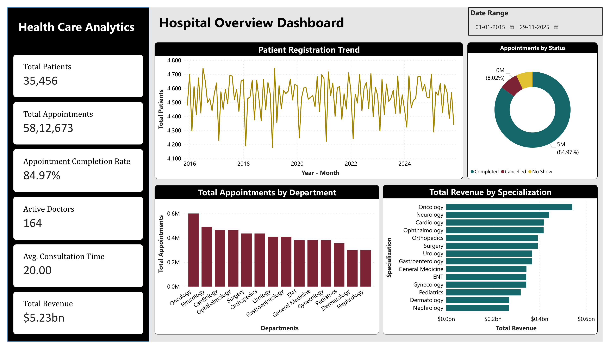
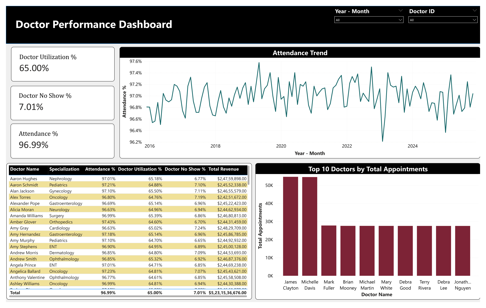
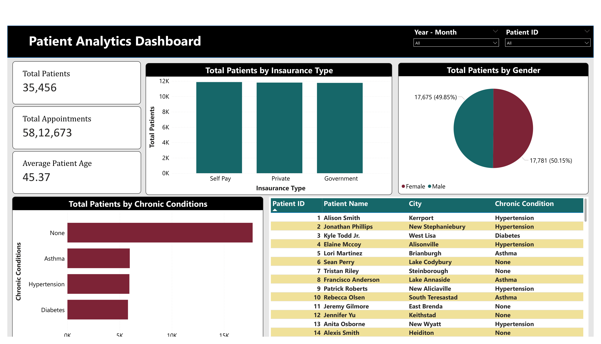
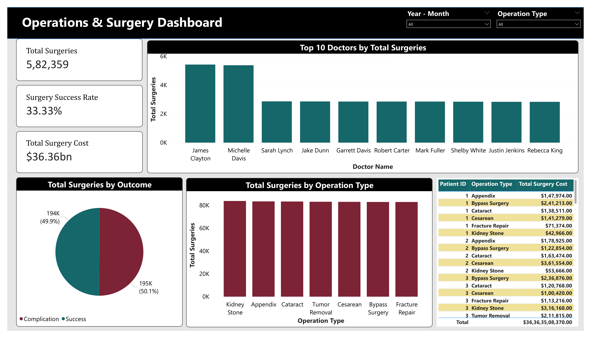
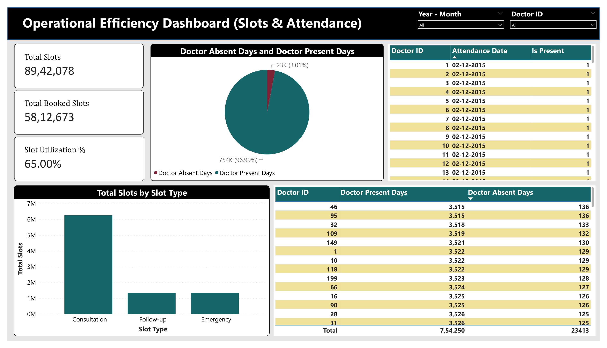

# 🏥 Healthcare Analytics End-to-End Project (Python + Power BI)

This repository contains a complete **Healthcare Analytics Project**, built using:

- **Python** (Faker-based realistic synthetic data generator)
- **Power BI** (Interactive Dashboards)
- **Star Schema Data Model**
- **Realistic hospital-like metrics**

This project simulates a real hospital environment covering **patients, doctors, appointments, surgeries, attendance, slots, and departments** with 10 years of historical data.

---

## 📸 Dashboard Preview

### Hospital Overview Dashboard



---

## 🚀 Project Features

### ✔ **Synthetic Healthcare Dataset (10 Years)**
Generated using Python (Faker + Random) with realistic distributions:
- Doctors (Specializations, experience, departments)
- Patients (Demographics, chronic conditions, insurance)
- Appointments (Status, duration, revenue)
- Operations (Type, outcome, cost)
- Doctor Attendance Logs
- Slot Scheduling System

### ✔ **Data Model (Star Schema)**

The project uses a star-schema approach to organize dimension and fact tables for analysis in Power BI.

---

## 📊 Dashboards Built in Power BI

### 1️⃣ **Hospital Overview Dashboard**
- Total Patients
- Total Appointments
- Appointment Completion Rate
- Active Doctors
- Average Consultation Time
- Total Revenue
- Patient Registration Trend
- Appointments by Status
- Appointments by Department
- Revenue by Specialization


### 2️⃣ **Doctor Performance Dashboard**
- Doctor Utilization %
- Doctor No Show %
- Attendance %
- Attendance Trend
- Doctor-level performance table
- Top 10 Doctors by Total Appointments
- Total Revenue by Doctor



### 3️⃣ **Patient Analytics Dashboard**
- Total Patients  
- Total Appointments  
- Average Patient Age  
- Chronic Condition Distribution  
- Gender & Insurance Segmentation  
- Patient-level details and city insights  



### 4️⃣ **Operations & Surgery Dashboard**
- Total Surgeries  
- Surgery Success Rate  
- Total Surgery Cost  
- Top 10 Doctors by Total Surgeries  
- Surgeries by Operation Type  
- Outcomes Distribution  



### 5️⃣ **Operational Efficiency Dashboard (Slots & Attendance)**
- Total Slots  
- Total Booked Slots  
- Slot Utilization %  
- Doctor Presence vs Absence  
- Total Slots by Slot Type  
- Doctor attendance details  



---

## 🛠 Tools Used

| Component | Tool |
|----------|------|
| Data Generation | Python, Faker |
| Data Storage | CSV Files |
| BI Modeling | Power BI Desktop |
| Visualization | Power BI Reports |
| Version Control | GitHub |

---

## 📁 Repository Structure

This script generates:
- Doctor Dimension  
- Patient Dimension  
- Department Dimension  
- Slots Dimension  
- Appointments Fact  
- Operations Fact  
- Attendance Fact  

Each CSV is exported into the `/data/` folder.

```text
├── data/
├── images/
│   ├── dashboard_1.png
│   ├── dashboard_2.png
│   ├── dashboard_3.png
│   ├── dashboard_4.png
│   └── dashboard_5.png
├── docs/
├── SampleData_Healthcare.ipynb
├── HealthCare Analytics.pbix
└── README.md
```

---

## 📈 Power BI Components

### Data Model Includes:
- Relationship mapping  
- Cleaned date table  
- DAX measures for insights  

### Dashboards:
- Hospital Overview
- Doctor Performance
- Patient Analytics  
- Surgery & Operations  
- Slot Utilization & Doctor Attendance  

The `.pbix` file is stored in the repository.

---

## 📄 Documentation

Located in the `/docs/` folder:

- `project_overview.pdf` → End-to-end explanation  
- `data_dictionary.md` → Table descriptions, fields, data types  

The dashboard screenshots are also included directly in this README so the project can be reviewed without opening the PDF.

---

## 🤝 How to Use This Project

### 1️⃣ Clone the Repository

```bash
git clone https://github.com/yourusername/healthcare-analytics-powerbi-project.git
cd healthcare-analytics-powerbi-project
```

### 2️⃣ Generate the Dataset

Open and run:

```text
SampleData_Healthcare.ipynb
```

### 3️⃣ Open the Power BI Report

Open the `.pbix` file in **Power BI Desktop** to explore the dashboards and interact with the report filters.

---

# 📘 Data Dictionary

## Dim_Patients
| Column | Description |
|--------|-------------|
| patient_id | Unique patient identifier |
| patient_name | Full name |
| gender | Male/Female |
| age | Age |
| blood_group | A+/O-/AB+ etc |
| city | Location |
| chronic_condition | Diabetes/BP/Asthma/None |
| insurance_type | Private/Government/Self Pay |

---

## Dim_Doctors
| Column | Description |
|--------|-------------|
| doctor_id | Unique doctor ID |
| doctor_name | Name |
| specialization | Cardiology/Oncology etc |
| department_id | FK to department |
| experience_years | Total experience |

---

## Fact_Appointments
| Column | Description |
|--------|-------------|
| appointment_id | Unique appointment |
| patient_id | FK to Dim_Patients |
| doctor_id | FK to Dim_Doctors |
| slot_id | FK to Dim_Slots |
| appointment_date | Date of appointment |
| appointment_status | Completed/Cancelled/No Show |
| revenue | Consultation fee |

---

## Fact_Operations
| Column | Description |
|--------|-------------|
| operation_id | Unique surgery |
| patient_id | FK |
| doctor_id | FK |
| department_id | FK |
| cost | Surgery cost |
| outcome | Success/Complication/ICU Needed |

---

## Fact_Attendance
| Column | Description |
|--------|-------------|
| doctor_id | FK |
| attendance_date | Date |
| is_present | 1/0 |

---
